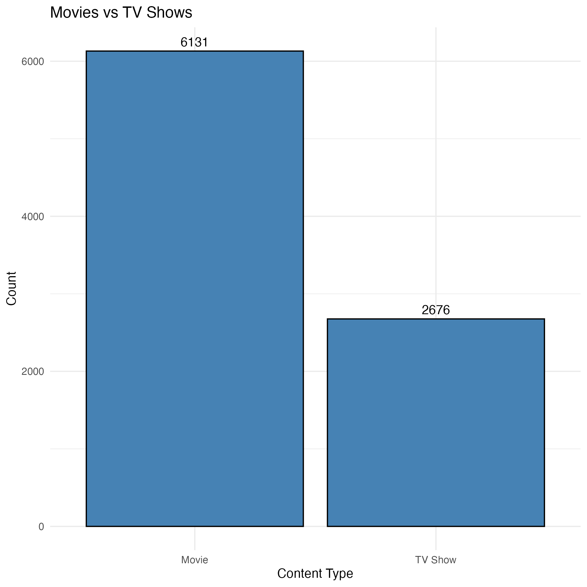
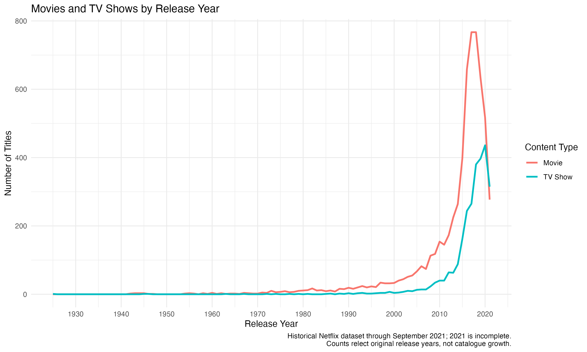
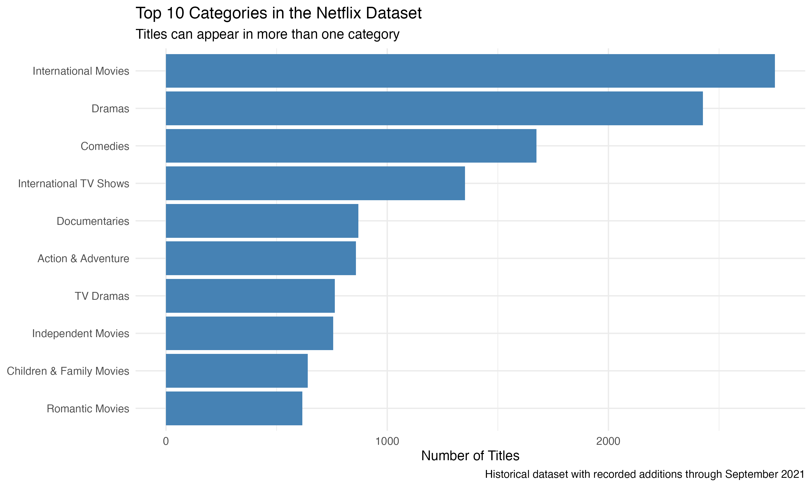
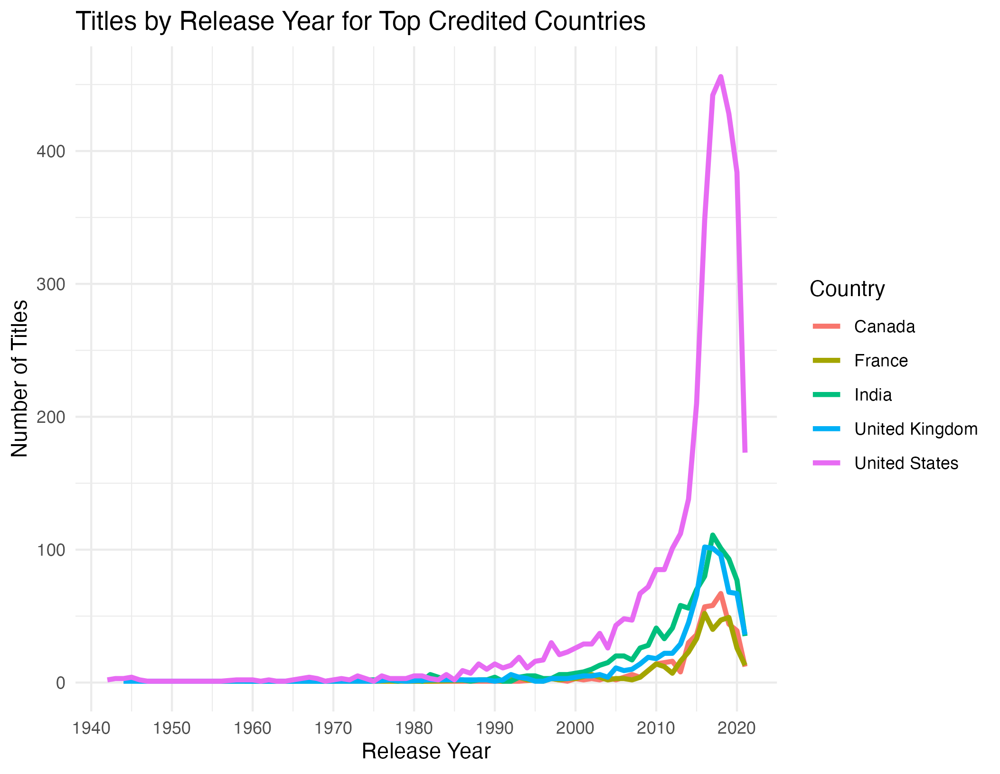

# Netflix Content Analysis in R

An individual university project exploring content types, release years, categories, and credited countries in a historical Netflix dataset.

## Tools Used

- R
- ggplot2
- dplyr
- tidyr

## Dataset

The dataset contains 8,807 titles, with original release years from 1925 to 2021. The latest recorded addition is 25 September 2021.

Source: [Netflix Movies and TV Shows on Kaggle](https://www.kaggle.com/datasets/shivamb/netflix-shows)

## Project Questions

- How many titles are movies compared with TV shows?
- How do release-year distributions differ between content types?
- Which categories appear most frequently?
- Which countries are most frequently credited?

## Data Preparation

- Split comma-separated category labels into individual categories.
- Removed missing country entries from country analysis.
- Split multi-country entries into individual credited countries.
- Trimmed whitespace from category and country labels.
- Filled missing year/content-type combinations with zero counts.

Titles can have multiple categories and credited countries, so these counts overlap.

## Key Findings

- Movies account for 6,131 titles (69.6%).
- TV shows account for 2,676 titles (30.4%).
- International Movies appears on 2,752 titles, followed by Dramas on 2,427.
- The United States is credited on 3,690 titles, including co-productions.
- TV shows have a median release year of 2018, compared with 2016 for movies.

## Visualisations

### Content Types

### Titles by Release Year

Counts reflect original release years, not Netflix catalogue growth.

### Top Categories

### Credited Countries

Country counts include co-productions and exclude missing country entries.

## How to Run

1. Install R and the packages ggplot2, dplyr, and tidyr.
2. Download and extract netflix_titles.csv from the source into the data folder.
3. Open the .Rproj file in RStudio.
4. Open analysis.R and click Source.
5. Generated charts are saved in the images folder.

## Limitations

- This historical snapshot does not represent Netflix's current catalogue.
- Release-year counts do not establish catalogue growth or production growth.
- Data for 2021 is incomplete.
- Country information is missing for 831 titles (9.4%).
- Category and country counts overlap.
- The dataset contains no viewing figures, so category frequency does not indicate audience popularity.

## Project Context

Originally completed as individual university coursework, then refined for portfolio presentation with improved category counting, chart readability, and interpretation.